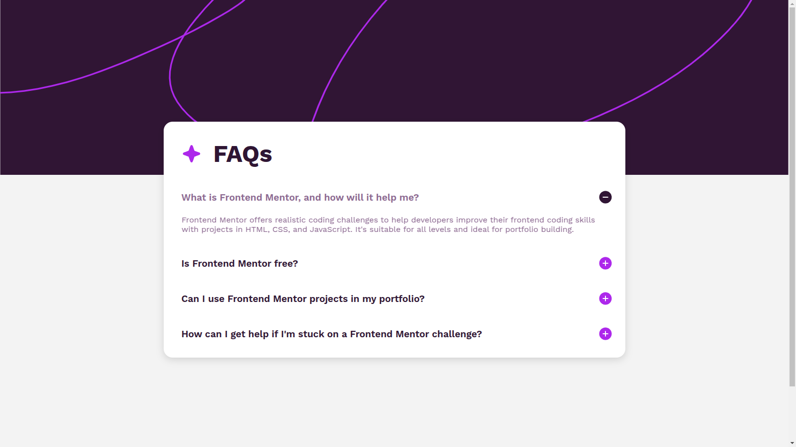
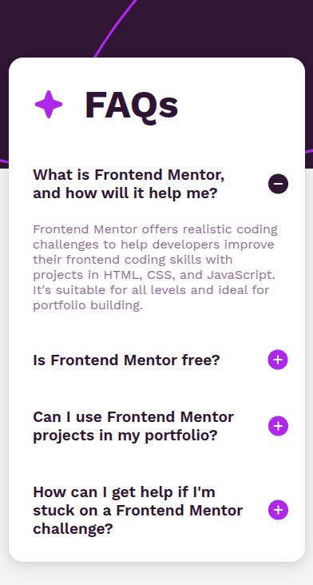

# Frontend Mentor - FAQ accordion solution

This is a solution to the [FAQ accordion challenge on Frontend Mentor](https://www.frontendmentor.io/challenges/faq-accordion-wyfFdeBwBz). Frontend Mentor challenges help you improve your coding skills by building realistic projects. 

## Table of contents

- [Overview](#overview)
  - [The challenge](#the-challenge)
  - [Screenshot](#screenshot)
  - [Links](#links)
- [Process](#process)
  - [Built with](#built-with)
- [Author](#author)

## Overview

### The challenge

Users should be able to:

- Hide/Show the answer to a question when the question is clicked
- Navigate the questions and hide/show answers using keyboard navigation alone
- View the optimal layout for the interface depending on their device's screen size
- See hover and focus states for all interactive elements on the page

### Screenshots

### Links

- Solution URL: [On GitHub](https://github.com/cursebreakers/faq-accordion)
- Live Site URL: [On GitHub Pages](https://cursebreakers.github.io/faq-accordion)

## Process

### Built with

- Vanilla JS
- Semantic HTML5 markup
- CSS custom properties
- Flexbox
- Mobile-first workflow

## Author

By Esau

- Website - [Cursebreakers LLC](https://cursebreakers.net)
- Frontend Mentor - [@cursebreakers](https://www.frontendmentor.io/profile/cursebreakers)

